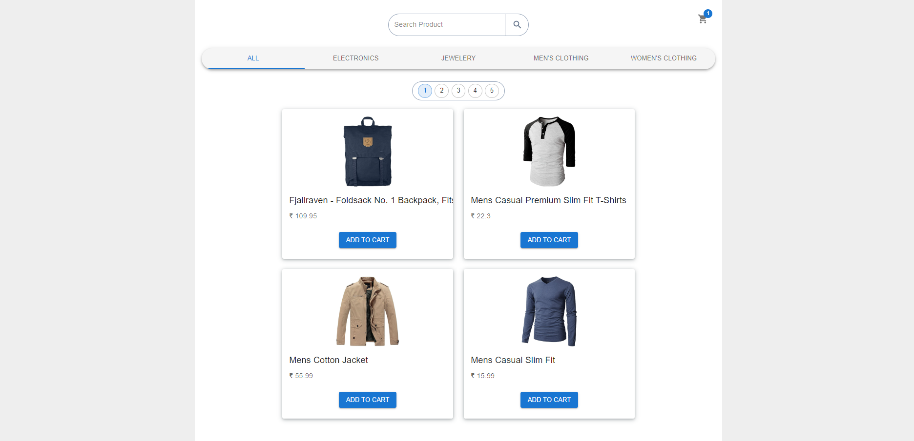

# FakeStore

<h2>This is the Image of a FakeStore</h2>

 

<h2>Technologies Used</h2>
<li>HTML</li>
<li>CSS</li>
<li>JavaScript</li>
<li>TailwindCSS</li>
<li>React</li>
<li>Material UI</li>
 

<h2>Features of this projects are given below:</h2>
<li><b>Shows List of Products</b></li>
<li><b>Search Product by Name in a Specific Category</b></li>
<li><b>Filter Products by Category</b></li>
<li><b>Product Details Page for more information about selected product</b></li>
<li><b>View Cart</b></li>
<li><b>Add Product in a Cart</b></li>
<li><b>Delete Product from a Cart</b></li>
<li><b>Shows Total Amount of Cart Products</b></li>
<li><b>Fully Responsive</b></li>
 

<h2>If you want to run this application in your system, Follow the below steps:</h2>
<h3>
<ol type="1">
   
  <li>
    Open a folder in a VS Code and go to the Terminal.
  </li>
   
  <li>
    Run the below command to clone repository
     "git clone https://github.com/moheebk123/Fakestore.git"
  </li>
   
  <li>
    Run the below command to change directory
     "cd .\Fakestore\"
  </li>
   
  <li>
    Run the below command to install necessary packages  "npm i" or
    "npm install"
  </li>
   
  <li>
    Run the below command to start development server "npm run dev"
  </li>
   
  <li>
    Go to the link provided by vite in terminal.
  </li>
</ol>
